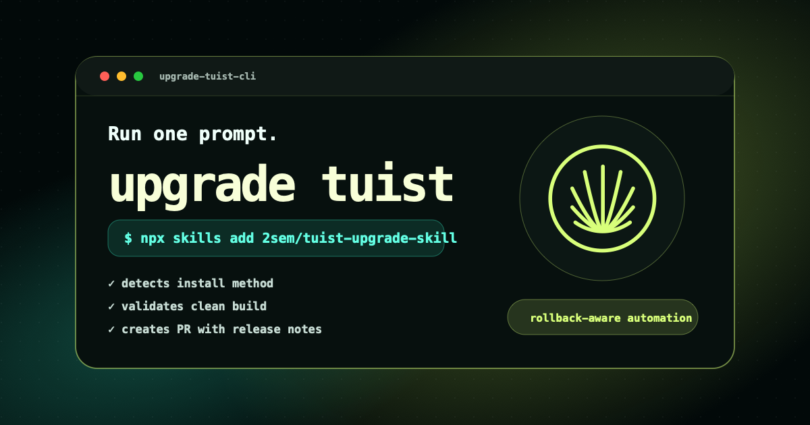

# tuist-upgrade-skill



Agent skill for safely upgrading the [Tuist](https://tuist.io/) CLI in iOS projects.

The skill detects how Tuist is installed, finds the latest stable Tuist release, upgrades the project/tooling, validates a clean build, rolls back on unresolved build failures, records failed versions, and opens a PR when the upgrade succeeds.

It runs Tuist non-interactively and uses `tuist generate --no-open` so Xcode is not launched during the upgrade.

## Install

```bash
npx skills add 2sem/tuist-upgrade-skill
```

Or install globally:

```bash
npx skills add 2sem/tuist-upgrade-skill -g
```

### OpenCode note

Some versions of the `skills` CLI install OpenCode-targeted skills into `.agents/skills`, while OpenCode installations commonly discover skills from `.opencode/skills` for project-local skills or `~/.config/opencode/skills` for global skills.

If `/skills` in OpenCode does not show `upgrade-tuist-cli` after running `npx skills add`, install it manually:

```bash
# Project-local OpenCode install
mkdir -p .opencode/skills/upgrade-tuist-cli
cp skills/upgrade-tuist-cli/SKILL.md .opencode/skills/upgrade-tuist-cli/SKILL.md
```

Or globally:

```bash
mkdir -p ~/.config/opencode/skills/upgrade-tuist-cli
cp skills/upgrade-tuist-cli/SKILL.md ~/.config/opencode/skills/upgrade-tuist-cli/SKILL.md
```

Then fully quit and restart OpenCode.

## Usage

Ask your agent for a Tuist upgrade, for example:

```text
upgrade tuist
```

```text
tuist upgrade to the latest stable version
```

## Included skill

| Skill | Description |
|---|---|
| `upgrade-tuist-cli` | Upgrades Tuist CLI safely, validates clean build, rolls back failed versions, records failure reasons, and opens a PR with release-change notes. |

## What the PR includes

- Old and new Tuist versions.
- Installation method detected and files changed.
- Notable Tuist release changes since the old version.
- Verification commands and results.
- Confirmation that generation used `--no-open` and Xcode was not opened intentionally.
- If latest stable cannot be used: the failed version, failure reason, rollback/fallback version, and investigation notes.
