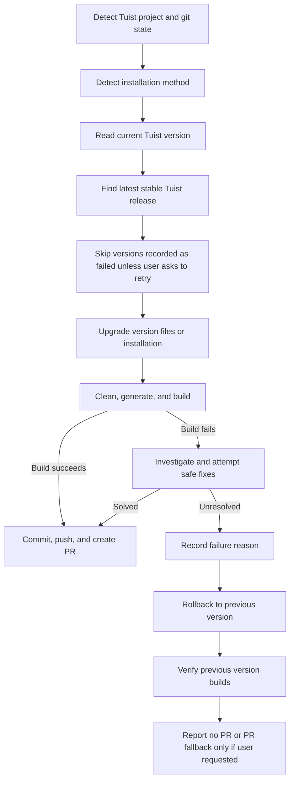

# Upgrade Tuist CLI

Use this skill to safely upgrade Tuist in a project and open a PR only when the new version builds successfully.

## Goal and success criteria

The upgrade is successful when:

- The project's Tuist version is pinned or updated to the selected stable version.
- The project can be generated and clean-built with that Tuist version.
- Failed candidate versions are rolled back and recorded with clear reasons.
- A commit is created, pushed, and a GitHub PR is opened when the build succeeds, unless the user explicitly says not to create a PR.
- The created PR is opened in the user's browser after successful PR creation.
- Xcode is not opened during the workflow; generation uses `--no-open` when supported.

## Trigger phrases

Use this skill when the user says any of:

- `tuist upgrade`
- `upgrade tuist`
- `upgrade Tuist CLI`
- `update tuist version`
- `bump tuist`

## Workflow overview



## Preflight safety rules

1. Inspect git status before editing:
   - `git status --short --branch`
   - `git diff`
   - `git log --oneline -10`
2. Preserve unrelated user changes. Do not overwrite or stage unrelated files.
3. Do not commit, push, or create a PR before the clean build succeeds.
4. After the clean build succeeds, creating the commit, pushing the branch, and opening the PR is required unless the user explicitly requested "no commit", "no push", "no PR", or the repo lacks a usable GitHub remote/authentication.
5. If the working tree has unrelated changes, either:
   - leave them untouched and stage only Tuist upgrade files, or
   - ask one short question if they block the upgrade.
6. Do not open Xcode as part of the upgrade workflow. Use non-interactive CLI generation/build commands only.
7. Never commit secrets, generated Xcode projects if ignored, DerivedData, build logs containing secrets, or local machine paths unless intentionally part of project config.

## Step 1 — Confirm this is a Tuist project

Look for at least one of:

- `Tuist.swift`
- `Tuist/Package.swift`
- `Project.swift`
- `Workspace.swift`
- `mise.toml` or `.tool-versions` containing `tuist`

If no Tuist markers exist, stop and report that the project does not appear to use Tuist.

## Step 2 — Detect how Tuist is installed

Check in this order and record the detected method in notes for the PR:

### Project-pinned tool managers

- `mise.toml`, `.mise.toml`, or `.config/mise/config.toml`
  - Look for `tuist = "..."` under `[tools]`.
  - Preferred command: `mise x -- tuist ...` or absolute mise path if project docs require it.
- `.tool-versions`
  - Look for `tuist <version>`.
  - Use `asdf exec tuist ...` if asdf is the project convention.
- `.tuist-version` or `.tuistenv-version`
  - Treat as a project-pinned version file.

### Package managers or global installation

- `brew list tuist` / `brew info tuist`
- `mint list` or `Mintfile`
- `which tuist` and `tuist version`
- CI files referencing Tuist setup actions or install scripts.

Prefer updating project-pinned version files over changing global machine state. If only a global install exists, ask one short question before changing it unless the user explicitly requested a machine-wide upgrade.

## Step 3 — Read current Tuist version

Record both:

- **Configured version**: from `mise.toml`, `.tool-versions`, `.tuist-version`, etc.
- **Executable version**: from the project command, e.g. `mise x -- tuist version` or `tuist version`.

If the configured value is `latest`, resolve and record the actual executable version before changing it. The old version for PR release notes should be the resolved executable version when available.

## Step 4 — Find latest stable Tuist version from GitHub

Use GitHub releases and exclude prereleases/canaries:

```bash
gh api --method GET repos/tuist/tuist/releases -F per_page=100 \
  --jq '[.[] | select(.prerelease == false) | select(.tag_name | test("^4\\\\.[0-9]+\\\\.[0-9]+$"))][0].tag_name'
```

Fallback without `gh`:

```bash
curl -fsSL https://api.github.com/repos/tuist/tuist/releases?per_page=100 \
  | python3 -c 'import json,sys,re; releases=json.load(sys.stdin); print(next(r["tag_name"] for r in releases if not r.get("prerelease") and re.match(r"^4\\.[0-9]+\\.[0-9]+$", r["tag_name"])))'
```

Do not use tags containing `canary`, prereleases, or non-CLI components such as `server@...` or `xcresult-processor-image@...`.

## Step 5 — Check recorded failed versions

Before upgrading, check for a project-local failure log:

- `.tuist-upgrade-failures.md`

If the latest stable version is recorded as failed:

1. Read the failure reason.
2. Unless the user explicitly asks to retry, select the newest stable version below the failed version that is not recorded as failed.
3. The PR body must explain why latest stable is not used.

Failure log entry format:

```markdown
## Tuist <version> — <YYYY-MM-DD>

- Previous version: `<old-version>`
- Project: `<repo or path>`
- Install method: `<mise/asdf/brew/mint/global/unknown>`
- Failure stage: `<install/generate/build/test>`
- Error summary: `<short actionable summary>`
- Evidence: `<command and key error lines or log path>`
- Attempted fixes: `<what was tried>`
- Rollback version: `<version>`
```

Commit this failure log only if the user wants the failed-version memory tracked in the repository. Otherwise, write it as an uncommitted local note and mention it in the final response.

## Step 6 — Upgrade Tuist version

Apply the upgrade according to the detected installation method:

### mise

Update the project version file:

```toml
[tools]
tuist = "<target-version>"
```

Then verify:

```bash
mise x -- tuist version
```

If project docs require an absolute mise path, use that path consistently.

### asdf

Update `.tool-versions`:

```text
tuist <target-version>
```

Then run:

```bash
asdf install tuist <target-version>
asdf exec tuist version
```

### .tuist-version / tuistenv

Replace the file content with `<target-version>` and verify with the project's Tuist launcher.

### Homebrew / Mint / global

Prefer not to change global installation in an app repo. If unavoidable, document the command used and ask before changing machine-wide tooling.

## Step 7 — Clean generate/build with the new Tuist

Use the project's documented commands first. Common command order:

```bash
<tuist-command> clean
<tuist-command> generate --no-open
```

Always pass `--no-open` to `tuist generate` when supported so Xcode does not launch during the upgrade. If the installed Tuist version does not support `--no-open`, use the equivalent non-opening option for that version, or run generation in a way that does not open Xcode. Do not use a plain `tuist generate` if it opens the workspace.

For building, prefer modern Tuist if supported:

```bash
<tuist-command> xcodebuild build <project-specific-args>
```

Fallback if the project still uses it:

```bash
<tuist-command> build
```

For Swift/Xcode output, if an output formatter such as `xcsift` is available or project instructions require it, pipe build output through that formatter.

## Step 8 — Investigate build failures

If the new Tuist cannot generate or build:

1. Capture the exact failing command and key error lines.
2. Classify the failure:
   - Tuist installation/version resolution problem
   - Manifest API breakage
   - Project generation behavior change
   - SwiftPM/package resolution issue
   - Xcode/build setting compatibility issue
   - Existing project compile failure unrelated to Tuist
3. Read Tuist release notes between old and target version and look for related changes.
4. Attempt safe fixes only when they are clearly required by the Tuist upgrade and are low-risk.
5. Re-run clean/generate/build after each fix.

Do not perform broad refactors while upgrading Tuist.

## Step 9 — Roll back if unresolved

If the build issue cannot be solved safely:

1. Restore the previous Tuist version in the version file.
2. Re-run version check and the previously successful generate/build command.
3. Record the failed target version and reason in `.tuist-upgrade-failures.md` or a local note.
4. Do not create a success PR for the failed version.
5. If there is a lower stable version newer than the old version, optionally try it if time allows and the user did not prohibit fallback versions.

## Step 10 — Create PR after build success

This step is mandatory after successful verification. Do not stop with only a success summary such as "No commit or PR was created" unless one of these blockers applies:

- the user explicitly requested no commit/push/PR,
- the directory is not a git repository,
- there is no GitHub remote,
- `gh` is unavailable or unauthenticated,
- branch protection or permissions prevent pushing/opening the PR,
- unrelated user changes make it unsafe to stage the intended files and the user has not clarified.

If blocked, report the exact blocker and the commands/files that are ready for the user to run. Otherwise, create the PR.

Before committing:

```bash
git status --short --branch
git diff
git log --oneline -10
```

Commit only intended files, usually one or more of:

- `mise.toml`, `.tool-versions`, `.tuist-version`, or equivalent
- package lockfiles changed by `tuist generate` or package resolution
- minimal manifest changes required for new Tuist compatibility
- `.tuist-upgrade-failures.md` only if intentionally tracked

Create a branch name like:

```text
chore/upgrade-tuist-<version-with-dashes>
```

Use a concise commit message:

```text
chore: upgrade Tuist to <version>
```

Then run the full PR sequence:

```bash
git switch -c chore/upgrade-tuist-<version-with-dashes>
git add <intended-version-files-and-lockfiles>
git commit -m "chore: upgrade Tuist to <version>"
git push -u origin chore/upgrade-tuist-<version-with-dashes>
gh pr create --base <base-branch> --head chore/upgrade-tuist-<version-with-dashes> --title "chore: upgrade Tuist to <version>" --body "<PR body>"
```

If already on a feature branch, do not switch branches without checking status. You may commit on the current branch if it is clearly dedicated to the Tuist upgrade.

After `gh pr create` succeeds, open the PR in the user's browser:

```bash
gh pr view --web
```

If `gh pr view --web` fails, report the PR URL, the browser-open failure, and include the PR body/change summary directly in the final prompt response so the user can review what changed without opening the browser. Do not treat browser-open failure as an upgrade failure.

## Release-note collection for PR body

Fetch release notes from old version exclusive to selected version inclusive:

```bash
gh api --method GET repos/tuist/tuist/releases -F per_page=100 --paginate \
  --jq '.[] | select(.tag_name|test("^4\\\\.[0-9]+\\\\.[0-9]+$")) | {tag_name, html_url, body}'
```

Summarize for the PR body by grouping into:

- SwiftPM/package resolution changes
- Project generation changes
- Build/test/caching changes
- CLI behavior/deprecations
- Breaking or migration-relevant notes

Do not paste every release note unless the range is small. Link to the selected release and mention the range.

## PR body template

```markdown
## Summary

- Upgrades Tuist from `<old-version>` to `<new-version>` using `<install-method>`.
- Updates `<version-file>` to pin the new Tuist version.
- Regenerates/resolves project files as needed.

## What changed in Tuist since `<old-version>`

Notable changes included in this upgrade:

- `<grouped release-note summary>`
- `<grouped release-note summary>`
- `<grouped release-note summary>`

Release range: `<old-version>` → `<new-version>`
Selected release: https://github.com/tuist/tuist/releases/tag/<new-version>

## Latest stable decision

- Latest stable checked: `<latest-stable-version>`
- Version used in this PR: `<new-version>`
- Can use latest stable: `<yes/no>`
- If no, reason: `<failure summary and fallback rationale>`

## Verification

- [x] `<tuist-command> version` → `<new-version>`
- [x] `<tuist-command> clean`
- [x] `<tuist-command> generate --no-open`
- [x] `<tuist-command> xcodebuild build ...` or `<tuist-command> build`

## Notes

- `<warnings, deprecations, or follow-ups>`
```

## Final response

Return:

- PR URL and whether it was opened in the browser. If browser opening failed, include the PR body/change summary inline in the response.
- If no PR was created, include the explicit blocker from Step 10; do not simply say no PR was created after a successful build.
- Old version, selected version, and latest stable version.
- Build verification result.
- If no PR was created: rollback status and failed-version memory location.
